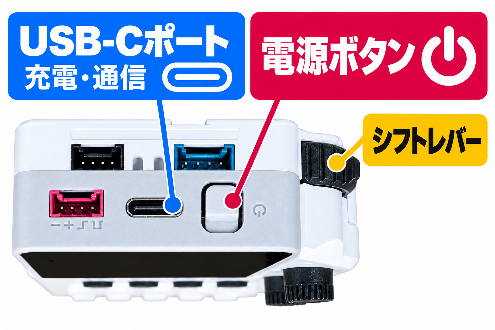
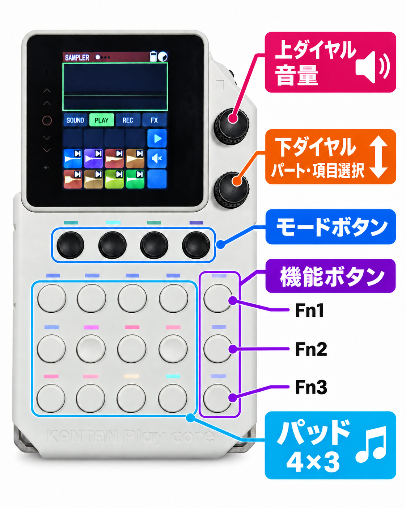

# はじめての5分

このページでは、KANTAN Samplerの楽しさを、次の3つの体験を通して覚えます。

1. サンプル（音）を鳴らす
2. ビートに合わせて演奏する
3. 演奏を記録する

難しい設定はありません。初期状態のまま、上から順に操作すれば約5分で体験できます。

## 始める前に

**電源ボタンは本体上面にあります。**

{ .device-top-controls loading=lazy }

- **電源**：本体の電源を入れる
- **音量**：右側の上のダイヤルを回す（最初は小さめに）
- **音を止める**：右側の上のダイヤルを押す

{ .device-controls-mobile loading=lazy }

このページでは、以降この図の名称を使います。

### パートとモード

KANTAN Samplerは、**どの音を使うか**と**何をするか**を組み合わせて操作します。

  

    <strong>パート</strong>
    どの音を使うか
    <code>BEAT / SAMPLER / BASS / MELODY / CHORD</code>
    <small>右側の下のダイヤルで選ぶ</small>
  

  
＋

  

    <strong>モード</strong>
    その音で何をするか
    <code>SOUND / PLAY / REC / FX</code>
    <small>画面下の4つの黒いボタンで選ぶ</small>
  

このページでは <code>SAMPLER</code> ＋ <code>PLAY</code> から始めます。

写真のように、画面上部へ`SAMPLER`、モード欄へ`PLAY`が表示されていれば準備完了です。

表示が違う場合は、次のように戻します。

1. 右側の下のダイヤルを回し、パート選択から`SAMPLER`を選びます
2. 画面下にある4つの黒いモードボタンのうち、左から2番目の`PLAY`を押します

[パートとモードを詳しく見る](reference/screen-and-controls.md)

## 1. サンプル（音）を鳴らす

画面の下半分には、各ボタンの役割が表示されます。

`SAMPLER`では、パッドにサンプル（音）が割り当てられています。パッドを押して、音を鳴らしてみましょう。

画面上で空欄のパッドには、音が割り当てられていません。

**こんなこともできます**

- [ボタンの音を変える・追加する](tutorials/add-sample.md)
- [マイクで新しい音を録音する](tutorials/record-sample.md)
- [音の長さ・音量・音程を調整する](tutorials/edit-sample.md)

## 2. ビートに合わせて演奏する

右端の一番上にある機能ボタン（`Fn1`）には、再生マークが表示されています。

このボタンを押すとビートが始まり、もう一度押すと止まります。

ビートに合わせて、好きなサンプルのパッドを押してみましょう。

**こんなこともできます**

- [ビートを変える](tutorials/select-beat.md)
- [ビートの音色（ドラムキット）を変える](tutorials/select-beat.md#change-beat-kit)
- [ビートのテンポを変える](tutorials/beat-settings.md#change-tempo)

## 3. 演奏を記録する

`REC`モードでは、パッドで演奏した内容を記録できます。

4つの黒いモードボタンのうち、左から3番目を押して`REC`モードに切り替えます。

ビートに合わせて演奏すると、押した内容が記録され、繰り返し再生されます。

### 演奏を記録したくないとき

左から2番目の黒いモードボタンを押して、`PLAY`モードに切り替えます。`PLAY`モードでは、パッドを押しても演奏は記録されません。

### 記録した演奏を一時的に消音するとき

右端の下から2番目にある、ミュートアイコンのボタン（`Fn2`）を押します。現在のパートに記録された演奏だけをミュート（消音）できます。もう一度押すと元に戻ります。

## 4. 間違えた演奏を取り消す

### 直前の記録を取り消す

`REC`モードで、右端の一番下にあるゴミ箱アイコンのボタン（`Fn3`）を短く押します。

### このパートの記録をすべて消す

同じボタン（`Fn3`）を長押しします。

## これで基本操作は完了です

サンプルを鳴らす、ビートに合わせて演奏する、演奏を記録する、の3つを体験できました。

[やりたいことから選ぶ](index.md#choose-by-purpose){ .md-button .md-button--primary }
